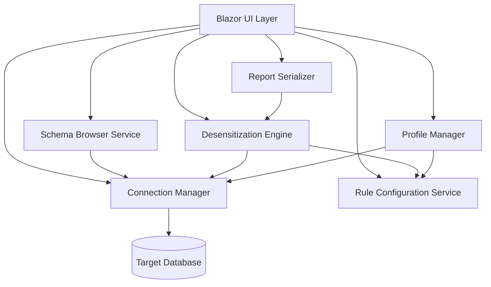
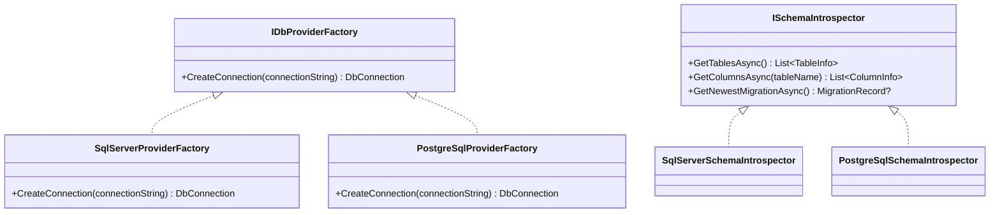

# Design Document: Data Desensitization

## Overview

This design describes a .NET 8 Blazor application for desensitizing sensitive data in relational databases. The application connects to SQL Server or PostgreSQL databases, lets users browse schemas, configure desensitization rules per column, execute transformations transactionally, and manage reusable profiles with schema version validation via EF Core's `__EFMigrationsHistory` table.

The system is composed of four main subsystems:

1. **Connection & Schema** — manages database connections and schema introspection
2. **Rule & Strategy Engine** — handles desensitization rule configuration, auto-detection, and strategy execution
3. **Execution Pipeline** — orchestrates transactional per-table desensitization with progress tracking and cancellation
4. **Profile & Reporting** — manages profile export/import (with migration version checking) and execution report serialization



## Architecture

The application follows a layered architecture within a Blazor Server app:

### Layer Breakdown

- **Presentation Layer (Blazor Components)**: Razor components for connection management, schema browsing, rule configuration, preview, execution progress, and profile management.
- **Service Layer**: Stateful services registered via DI that encapsulate business logic — `ConnectionManager`, `SchemaService`, `RuleConfigurationService`, `DesensitizationEngine`, `ProfileManager`, `ReportSerializer`.
- **Data Access Layer**: Uses ADO.NET (`DbConnection`, `DbCommand`, `DbTransaction`) directly for cross-provider compatibility. No EF Core ORM for the target database — only raw SQL for schema introspection, data reads, and updates. EF Core's `__EFMigrationsHistory` is read via raw SQL as well.
- **Strategy Layer**: A strategy pattern implementation where each `IDesensitizationStrategy` encapsulates a specific transformation algorithm.

### Provider Abstraction

Database provider differences (SQL Server vs PostgreSQL) are abstracted via:
- `IDbProviderFactory` — creates `DbConnection` instances for the selected provider
- `ISchemaIntrospector` — provider-specific SQL for schema queries (e.g., `INFORMATION_SCHEMA` for SQL Server, `information_schema` + `pg_catalog` for PostgreSQL)



## Components and Interfaces

### ConnectionManager

Manages the lifecycle of database connections.

```csharp
public interface IConnectionManager
{
    Task<ConnectionResult> ConnectAsync(string connectionString, DatabaseProvider provider, CancellationToken ct = default);
    Task DisconnectAsync();
    DbConnection? CurrentConnection { get; }
    ConnectionStatus Status { get; }
    event Action<ConnectionStatus>? StatusChanged;
}
```

- `ConnectAsync` enforces a 30-second timeout.
- `ConnectionResult` contains `Success`, `DatabaseName`, `ServerAddress`, and `ErrorMessage`.
- `DatabaseProvider` is an enum: `SqlServer`, `PostgreSql`.

### SchemaService

Retrieves schema metadata from the connected database.

```csharp
public interface ISchemaService
{
    Task<List<TableInfo>> GetTablesAsync(CancellationToken ct = default);
    Task<List<ColumnInfo>> GetColumnsAsync(string tableName, CancellationToken ct = default);
    Task<List<TableInfo>> SearchTablesAsync(string filter, CancellationToken ct = default);
}
```

- `TableInfo`: `SchemaName`, `TableName`.
- `ColumnInfo`: `ColumnName`, `DataType`, `IsNullable`, `MaxLength`.

### IDesensitizationStrategy

Strategy pattern for data transformation.

```csharp
public interface IDesensitizationStrategy
{
    string Name { get; }
    bool IsCompatibleWith(ColumnInfo column);
    object? GenerateValue(object? originalValue, ColumnInfo column, StrategyParameters parameters);
}
```

Built-in implementations:
- `RandomizationStrategy` — generates random values matching column type; text columns respect `MinLength`/`MaxLength` parameters.
- `MaskingStrategy` — replaces characters with a configurable mask char, preserving `PreserveStart`/`PreserveEnd` characters.
- `NullificationStrategy` — returns `DBNull.Value`; only compatible with nullable columns.
- `FixedValueStrategy` — returns a user-specified constant; validates type compatibility.
- `ShufflingStrategy` — collects all values in the column, shuffles, and redistributes.

### RuleConfigurationService

Manages the set of active desensitization rules.

```csharp
public interface IRuleConfigurationService
{
    IReadOnlyList<DesensitizationRule> Rules { get; }
    ValidationResult AddRule(DesensitizationRule rule);
    void RemoveRule(string tableName, string columnName);
    ValidationResult ValidateRule(DesensitizationRule rule, ColumnInfo column);
    List<DesensitizationRule> AutoDetectRules(List<TableInfo> tables, List<ColumnInfo> allColumns);
}
```

- `AutoDetectRules` scans column names against known patterns and assigns default strategies.
- `ValidateRule` checks strategy-column type compatibility.

### DesensitizationEngine

Orchestrates the execution pipeline.

```csharp
public interface IDesensitizationEngine
{
    Task<ExecutionReport> ExecuteAsync(IReadOnlyList<DesensitizationRule> rules, CancellationToken ct = default);
    Task<PreviewResult> PreviewAsync(string tableName, IReadOnlyList<DesensitizationRule> tableRules, int maxRows = 10, CancellationToken ct = default);
    event Action<ProgressInfo>? ProgressChanged;
}
```

- `ExecuteAsync` processes each table in its own transaction.
- On error, rolls back the current table's transaction, logs the error, and continues.
- `PreviewAsync` generates sample output without writing to the database.
- `ProgressInfo`: `CurrentTable`, `RowsProcessed`, `TotalRows`, `EstimatedTimeRemaining`.

### ProfileManager

Handles profile persistence, export, and import with schema version validation.

```csharp
public interface IProfileManager
{
    Task SaveProfileAsync(string name, IReadOnlyList<DesensitizationRule> rules);
    Task<ProfileLoadResult> LoadProfileAsync(string name);
    Task ExportProfileAsync(string filePath, IReadOnlyList<DesensitizationRule> rules, string connectionString);
    Task<ProfileImportResult> ImportProfileAsync(string filePath);
}
```

- `ExportProfileAsync` includes the connection string and the newest `__EFMigrationsHistory` record in the JSON.
- `ImportProfileAsync` reads the JSON, queries the target database's `__EFMigrationsHistory`, and compares. If the newest migration doesn't match, it returns an error result blocking the import.
- `ProfileLoadResult` includes `UnmatchedRules` for columns not found in the current schema.

### ReportSerializer

Handles execution report JSON serialization/deserialization.

```csharp
public interface IReportSerializer
{
    string Serialize(ExecutionReport report);
    ExecutionReport Deserialize(string json);
    Task ExportToFileAsync(ExecutionReport report, string filePath);
    Task<ExecutionReport> ImportFromFileAsync(string filePath);
}
```

- Uses `System.Text.Json` with configured `JsonSerializerOptions` for consistent round-trip behavior.

## Data Models

### Core Entities

```csharp
public enum DatabaseProvider { SqlServer, PostgreSql }

public enum ConnectionStatus { Disconnected, Connecting, Connected, Error }

public record ConnectionResult(
    bool Success,
    string? DatabaseName,
    string? ServerAddress,
    string? ErrorMessage);

public record TableInfo(string SchemaName, string TableName);

public record ColumnInfo(
    string ColumnName,
    string DataType,
    bool IsNullable,
    int? MaxLength);

public record MigrationRecord(string MigrationId, string ProductVersion);
```

### Desensitization Rules

```csharp
public enum DesensitizationStrategyType
{
    Randomization,
    Masking,
    Nullification,
    FixedValue,
    Shuffling
}

public record StrategyParameters
{
    // Randomization
    public int? MinLength { get; init; }
    public int? MaxLength { get; init; }

    // Masking
    public char MaskCharacter { get; init; } = '*';
    public int PreserveStart { get; init; }
    public int PreserveEnd { get; init; }

    // Fixed Value
    public string? FixedValue { get; init; }
}

public record DesensitizationRule(
    string TableName,
    string ColumnName,
    DesensitizationStrategyType Strategy,
    StrategyParameters Parameters);

public record ValidationResult(bool IsValid, string? ErrorMessage);
```

### Profile

```csharp
public record Profile
{
    public string Name { get; init; } = string.Empty;
    public string? ConnectionString { get; init; }
    public MigrationRecord? MigrationRecord { get; init; }
    public List<DesensitizationRule> Rules { get; init; } = new();
}

public record ProfileLoadResult(
    List<DesensitizationRule> MatchedRules,
    List<DesensitizationRule> UnmatchedRules);

public record ProfileImportResult(
    bool Success,
    string? ErrorMessage,
    ProfileLoadResult? LoadResult);
```

### Execution

```csharp
public record ProgressInfo(
    string CurrentTable,
    long RowsProcessed,
    long TotalRows,
    TimeSpan? EstimatedTimeRemaining);

public record TableExecutionResult(
    string TableName,
    long RowsUpdated,
    TimeSpan Elapsed,
    string? Error);

public record ExecutionReport
{
    public DateTime StartedAt { get; init; }
    public DateTime CompletedAt { get; init; }
    public TimeSpan TotalElapsed { get; init; }
    public List<TableExecutionResult> TableResults { get; init; } = new();
    public int TotalRowsUpdated => TableResults.Where(r => r.Error == null).Sum(r => (int)r.RowsUpdated);
    public int TotalErrors => TableResults.Count(r => r.Error != null);
}

public record PreviewResult(
    string TableName,
    List<PreviewRow> Rows);

public record PreviewRow(
    Dictionary<string, object?> OriginalValues,
    Dictionary<string, object?> DesensitizedValues);
```

### Sensitive Column Detection Patterns

Auto-detection uses a dictionary mapping regex patterns to default strategies:

| Pattern | Category | Default Strategy |
|---------|----------|-----------------|
| `(?i)(first\|last\|full)?_?name` | Name | Randomization |
| `(?i)e?mail` | Email | Masking (preserve 0 start, 0 end) |
| `(?i)phone\|mobile\|fax` | Phone | Masking (preserve 0 start, 4 end) |
| `(?i)address\|street\|city\|zip\|postal` | Address | Randomization |
| `(?i)ssn\|social_security` | SSN | Nullification |
| `(?i)credit_card\|card_number\|ccn` | Credit Card | Masking (preserve 0 start, 4 end) |
| `(?i)password\|pwd\|pass_hash` | Password | Nullification |

### JSON Serialization Configuration

`System.Text.Json` is configured with:
- `PropertyNamingPolicy = JsonNamingPolicy.CamelCase`
- `WriteIndented = true`
- `Converters` include `JsonStringEnumConverter` for enum readability
- `DefaultIgnoreCondition = JsonIgnoreCondition.WhenWritingNull`

This ensures consistent round-trip serialization for both `Profile` and `ExecutionReport` objects.

## Correctness Properties

*A property is a characteristic or behavior that should hold true across all valid executions of a system — essentially, a formal statement about what the system should do. Properties serve as the bridge between human-readable specifications and machine-verifiable correctness guarantees.*

### Property 1: Schema filter returns only matching items

*For any* list of tables/columns and any non-empty search string, filtering by name should return exactly those items whose name contains the search string (case-insensitive), and no matching items should be excluded.

**Validates: Requirements 2.4**

### Property 2: Randomization respects length bounds

*For any* text column and any valid min/max length configuration (where min ≤ max), the Randomization strategy should generate a string whose length is between min and max (inclusive).

**Validates: Requirements 3.2**

### Property 3: Masking preserves format

*For any* non-empty string, mask character, preserveStart count, and preserveEnd count (where preserveStart + preserveEnd ≤ string length), the Masking strategy should produce a result where the first `preserveStart` characters match the original, the last `preserveEnd` characters match the original, and all characters in between are the mask character.

**Validates: Requirements 3.3**

### Property 4: Strategy-type compatibility is correctly validated

*For any* combination of DesensitizationStrategyType and ColumnInfo, the `IsCompatibleWith` check should return false (and `ValidateRule` should produce an error) if and only if the strategy is incompatible with the column's data type — specifically, Nullification is incompatible with non-nullable columns, and FixedValue is incompatible when the provided value cannot be converted to the column's data type.

**Validates: Requirements 3.5**

### Property 5: Auto-detection correctly classifies columns and assigns default strategies

*For any* column name, the auto-detection function should identify it as sensitive if and only if it matches one of the known naming patterns, and when it does match, the assigned default DesensitizationStrategy should correspond to the correct category for that pattern.

**Validates: Requirements 4.1, 4.3**

### Property 6: Profile-schema rule matching partitions correctly

*For any* set of desensitization rules in a profile and any database schema, loading the profile should partition the rules into matched and unmatched sets such that: every matched rule has a corresponding table/column in the schema, every unmatched rule has no corresponding table/column, and the union of matched and unmatched equals the original rule set.

**Validates: Requirements 6.2, 6.3**

### Property 7: Profile JSON round-trip

*For any* valid Profile object (including connection string, migration record, and rules with all strategy parameters), serializing to JSON and then deserializing should produce an equivalent Profile object.

**Validates: Requirements 6.4, 6.5, 6.6**

### Property 8: Migration record comparison

*For any* two MigrationRecord values, the comparison function should return true if and only if both MigrationId and ProductVersion are equal, and should return false otherwise.

**Validates: Requirements 6.8**

### Property 9: ExecutionReport JSON round-trip

*For any* valid ExecutionReport object (including table results with row counts, elapsed times, and error messages), serializing to JSON and then deserializing should produce an equivalent ExecutionReport object.

**Validates: Requirements 8.3**

## Error Handling

### Connection Errors
- Timeout after 30 seconds with a descriptive `ConnectionResult.ErrorMessage`.
- Invalid credentials, unreachable host, and unsupported provider each produce distinct error messages.
- On disconnect failure, log the error and force-set status to `Disconnected`.

### Schema Introspection Errors
- If schema queries fail (e.g., permission denied), surface the database error message to the user and keep the schema browser empty.

### Rule Validation Errors
- Strategy-type incompatibility returns a `ValidationResult` with a description of the mismatch (e.g., "Nullification cannot be applied to non-nullable column `Users.Id`").
- Fixed Value strategy validates type convertibility at rule creation time, not at execution time.

### Execution Errors
- Per-table transaction: on any exception during a table's desensitization, the transaction is rolled back, the error is captured in `TableExecutionResult.Error`, and processing continues to the next table.
- Cancellation via `CancellationToken`: the current table's transaction is rolled back, and the `ExecutionReport` includes results for all completed tables plus a cancellation indicator.
- If no rules are configured, `ExecuteAsync` throws `InvalidOperationException` before starting any work.

### Profile Import Errors
- Schema version mismatch (migration record doesn't match): `ProfileImportResult.Success = false` with an error message specifying the expected vs. actual migration IDs.
- Malformed JSON: caught during deserialization, surfaced as a user-friendly error.
- Unmatched rules (columns not in schema): not a blocking error — import succeeds with warnings in `ProfileLoadResult.UnmatchedRules`.

### Report Serialization Errors
- Invalid JSON during deserialization: `JsonException` is caught and re-thrown as a domain-specific `ReportParsingException` with context about the failure.

## Testing Strategy

### Unit Tests

Unit tests cover specific examples, edge cases, and error conditions:

- **ConnectionManager**: mock `DbConnection` to test timeout enforcement, success/failure result construction, status transitions, and resource cleanup on disconnect.
- **SchemaService**: mock `ISchemaIntrospector` to test table/column retrieval and search filtering.
- **Strategy implementations**: test each strategy with concrete examples — Randomization with specific lengths, Masking with known inputs, Nullification on nullable/non-nullable columns, FixedValue with valid/invalid types, Shuffling with small datasets.
- **RuleConfigurationService**: test `AddRule` validation, `RemoveRule`, and `AutoDetectRules` with known column names.
- **DesensitizationEngine**: mock database layer to test execution flow, progress events, cancellation handling, and report generation.
- **ProfileManager**: test save/load with mocked storage, export/import JSON structure, migration record comparison, and unmatched rule detection.
- **ReportSerializer**: test serialization output format and deserialization of known JSON strings.

### Property-Based Tests

Property-based tests validate universal correctness properties using a PBT library. The recommended library is **FsCheck** (with the `FsCheck.Xunit` integration for xUnit).

Each property test:
- Runs a minimum of 100 iterations
- References its design document property via a tag comment
- Uses custom `Arbitrary` generators for domain types (`ColumnInfo`, `DesensitizationRule`, `Profile`, `ExecutionReport`, `MigrationRecord`)

| Property | Test Tag | Key Generators |
|----------|----------|----------------|
| Property 1: Schema filter | `Feature: data-desensitization, Property 1: Schema filter returns only matching items` | `Arb<List<TableInfo>>`, `Arb<string>` |
| Property 2: Randomization bounds | `Feature: data-desensitization, Property 2: Randomization respects length bounds` | `Arb<int>` for min/max with min ≤ max constraint |
| Property 3: Masking format | `Feature: data-desensitization, Property 3: Masking preserves format` | `Arb<string>` (non-empty), `Arb<char>`, `Arb<int>` for preserve counts |
| Property 4: Strategy compatibility | `Feature: data-desensitization, Property 4: Strategy-type compatibility is correctly validated` | `Arb<DesensitizationStrategyType>`, `Arb<ColumnInfo>` |
| Property 5: Auto-detection | `Feature: data-desensitization, Property 5: Auto-detection correctly classifies columns and assigns default strategies` | `Arb<string>` for column names (mix of sensitive patterns and random) |
| Property 6: Profile matching | `Feature: data-desensitization, Property 6: Profile-schema rule matching partitions correctly` | `Arb<List<DesensitizationRule>>`, `Arb<List<TableInfo>>` |
| Property 7: Profile round-trip | `Feature: data-desensitization, Property 7: Profile JSON round-trip` | `Arb<Profile>` with all nested types |
| Property 8: Migration comparison | `Feature: data-desensitization, Property 8: Migration record comparison` | `Arb<MigrationRecord>` pairs |
| Property 9: Report round-trip | `Feature: data-desensitization, Property 9: ExecutionReport JSON round-trip` | `Arb<ExecutionReport>` with nested `TableExecutionResult` |

### Integration Tests

Integration tests verify database interactions with real SQL Server and PostgreSQL instances (via Docker/Testcontainers):

- **Connection lifecycle**: connect, verify status, disconnect, verify cleanup.
- **Schema introspection**: verify tables/columns match a known test schema.
- **Transactional execution**: verify commit on success, rollback on injected failure, continuation after table error.
- **Cancellation**: verify in-progress execution can be cancelled with rollback.
- **Migration record query**: verify `__EFMigrationsHistory` reading against a test database with known migrations.
